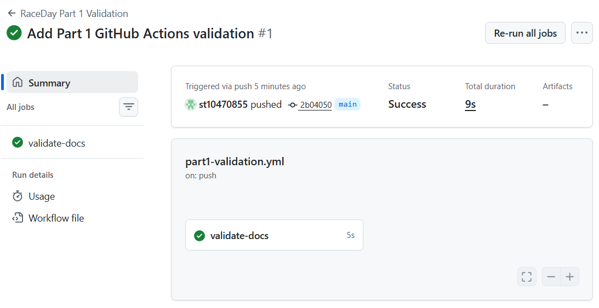

# RaceDay

## System Description

RaceDay is a full-stack event-management system designed for South African road running, walking, and cycling events. The system is designed to allow event organisers to manage events, categories, participant enrolments, and results, while participants can register for events and keep track of their own enrolments and results.

The project is being developed in three parts. Part 1 focuses on system planning, database design, API planning, and the SQL database script.

## User Roles

### Organiser

The Organiser is responsible for managing events and event-related information. Organisers can:

* Create, edit, and delete events.
* Manage event categories.
* Capture participant results.
* View all participant enrolments.

### Participant

The Participant can use the system to participate in available events. Participants can:

* Create an account.
* Browse available events.
* Enter an event by selecting an event category.
* View their own event enrolments.
* Track their personal results.

## Part 1 Documentation

The Part 1 planning and database documents are available in the `docs` folder:

* [RaceDay ERD](docs/RaceDay_ERD.png)
* [RaceDay API Endpoint Plan](docs/RaceDay%20API%20Endpoint%20Plan.pdf)
* [RaceDay Database SQL Script](docs/RaceDay_Database.sql)

## GitHub Actions / CI/CD

A GitHub Actions workflow is configured to validate the Part 1 repository structure and confirm that the required documentation and SQL database script are present.

### Successful CI/CD Build

## Part 1 Video

YouTube video demonstrating the RaceDay Part 1 work:

**YouTube link:** To be added
